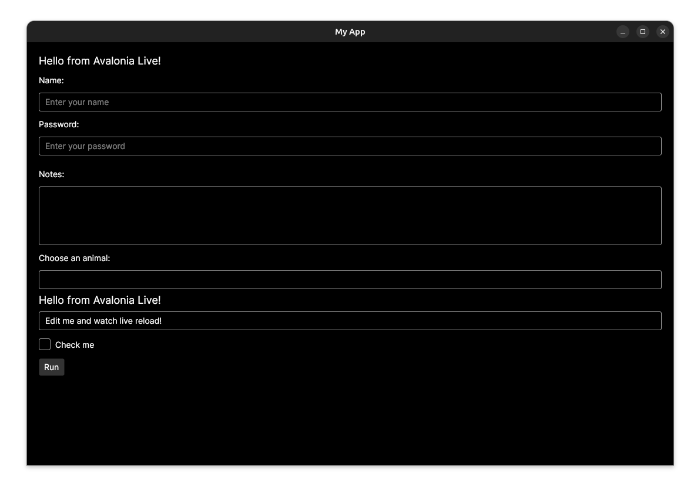

# Basic Ubuntu App | Desktop

This targets avalonia with hot reload enabled. 

### Rerefences Docs
https://docs.avaloniaui.net/docs/faq

https://github.com/AvaloniaUI/Live.Avalonia/tree/main

### To start for debugging

```
dotnet run
```

### To Publish

```
dotnet publish -c Release -r win-x64     --self-contained true
dotnet publish -c Release -r osx-arm64   --self-contained true
```

### To Execute on Ubuntu

```
cd bin/Release/net9.0/linux-x64/publish/
chmod +x HelloAvalonia
./HelloAvalonia
```

### Other requirements

```
dotnet new install Avalonia.Templates
dotnet new avalonia.app -o HelloAvalonia
cd HelloAvalonia
dotnet run
```


### Demo Screenshot


